# Onfall

Onfall is an offline-first combat and encounter tracker compatible with 5e and 5.5e (D&D 2024).
Multiplayer support is planned for the future. The application includes a separate Italian SRD
5.2.1 content pack for guided character creation, class progression, feats, actions and spells.
Its attribution and licence notice are in [`NOTICE-SRD.md`](NOTICE-SRD.md). The engine, user
interface and bundled encounter examples are original, and desktop and Android share the same
engine, data, and screens.

> **Read only repository.** This code is published solely for review and technical evaluation, that
> is, for analysis of the code and of the author's technical ability. It is not meant to be used, run
> as a game, forked, or reused in any part. See [`LICENSE.md`](LICENSE.md).

## What it is

Four parts living on the same engine:

1. the **Compendium**, an editable archive of characters, creatures, and reusable abilities;
2. an **encounter builder** that turns Compendium templates into an independent game session;
3. a **combat engine** that is independent from the interface, deterministic, audited, and undoable;
4. a **game interface** that presents the fight as a turn based battle.

Three destinations hold them together, and the navigation rail on the left collapses to icons, or
disappears entirely, when the table needs the room. The interface is in Italian, so the screenshots
below name them **Battaglia** (battle), **Partita** (session) and **Compendio** (Compendium).

## Starting a session

A session begins from one of three places: a **bundled encounter**, the **templates** already in the
Compendium, or a **saved session**. The three bundled encounters are written to be played as they
are and to show the engine at different points of a campaign: *Le rovine di Vallecupa* (level 1),
*Il guado di ferro* (level 4), *La corona spezzata* (level 20).

The builder then walks through four steps: where to start from, who takes part, the grid, and how to
begin. In the participants step each template gets a **faction** and a **quantity**, so the same
stat block can enter the fight four times without being duplicated in the archive. The grid step
sets columns, rows and the distance one square represents; every distance in the application is then
shown in feet and in metres together. The last step chooses between **Fight mode**, which lays allies
and enemies out facing each other and ready to roll, and **Roleplay & Fight & Exploration**, which
opens the same grid empty and leaves placement to the table.

A combatant is **copied** into the session, so changes to HP, conditions, turns, and position never
alter its Compendium template. Several sessions stay open at once in independent tabs, each with its
own map, turn order, dice state, event log and undo history.

<table>
<tr>
<td align="center">
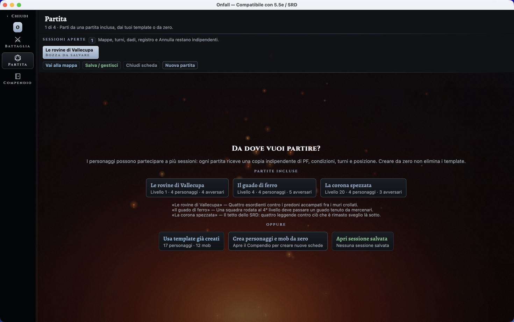<br/>
<sub>Starting a session — bundled encounters, saved templates, or a saved session</sub>
</td>
<td align="center">
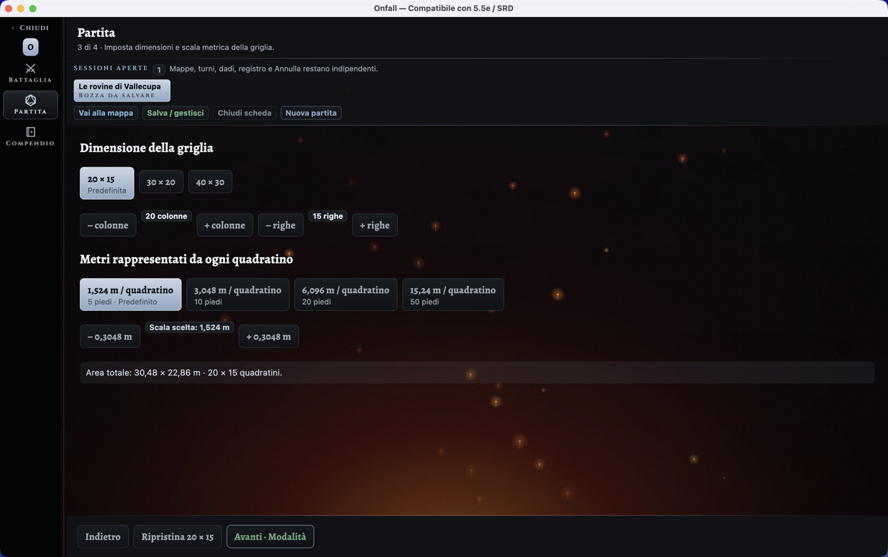<br/>
<sub>Encounter builder — grid size and the distance each square represents</sub>
</td>
</tr>
</table>

## The battle

On the desktop the battle screen keeps three areas visible together: the **party** on the left, the
**battle scene** in the center, the **enemies** on the right. The turn order runs across the top, and
the event log stays below the enemies. The side columns **resize by dragging their edge**, and when
they get narrow each combatant's information folds into a vertical list instead of being truncated.

The active combatant's abilities are listed under the map. Picking one puts the screen in aiming
mode; picking a target completes it. The engine covers attacks and area effects with digital d20
rolls, advantage and disadvantage, damage types, saving throws, conditions, concentration, death
saves, healing, temporary hit points and exhaustion, and it refuses what the rules refuse — an
out-of-range shot is reported as a warning, not silently resolved.

The tactical map is a grid. You **zoom with the mouse wheel**, drag the tokens to move them, and
change the scale and the size on screen. Map options set columns and rows, grid visibility and
opacity, the background image taken from the archive, and an automatic arrangement of every token.

**Table tools** cover the same state changes when they have to be entered by hand: an ability check
with its modifier, damage of a chosen type, healing, temporary hit points, conditions and
exhaustion, on any combatant and not only the one holding the turn.

With **Edit mode** on, the table composes the scene freely: it corrects name, AC, HP, and initiative
directly on the cards, reorders the turns and picks the current one, adds combatants to either side,
drags characters from the side bars onto the map, and moves tokens ignoring the movement limits.
Outside Edit mode those shortcuts disappear, so a session is not altered by mistake.

Every action lands in an **append-only event log**, and successful engine commands can be undone
without advancing the random number generator, so the rolls that follow an undo are the rolls that
would have followed anyway.

<table>
<tr>
<td align="center">
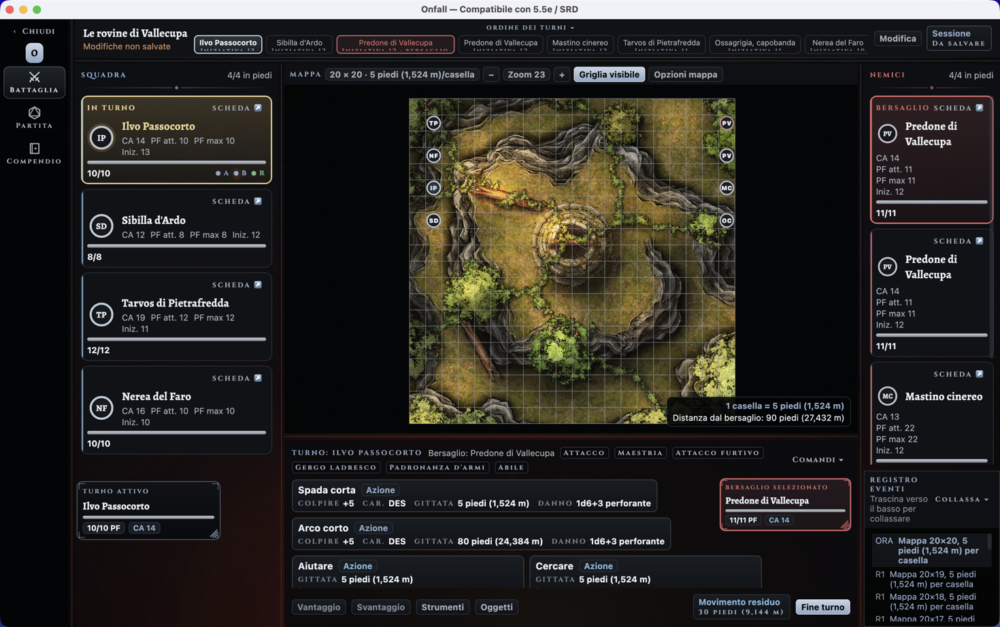<br/>
<sub>Battle screen — party, tactical map, enemies, turn order, event log</sub>
</td>
<td align="center">
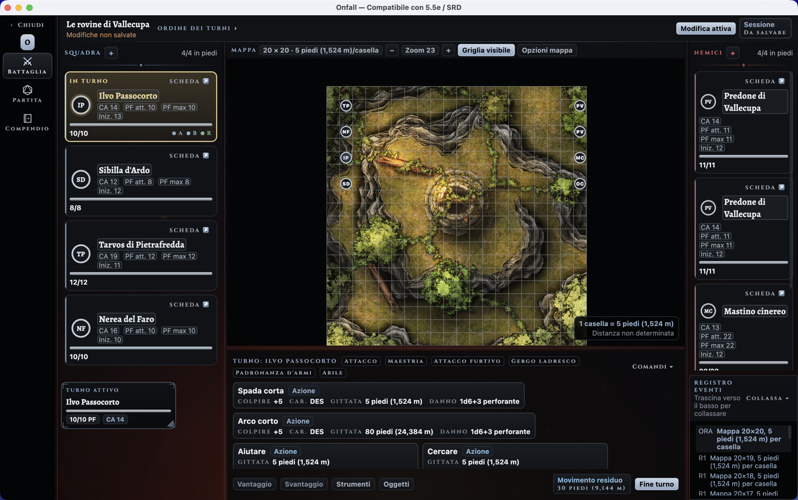<br/>
<sub>Edit mode — name, AC, HP and initiative corrected on the cards, tokens moved freely</sub>
</td>
</tr>
<tr>
<td align="center" colspan="2">
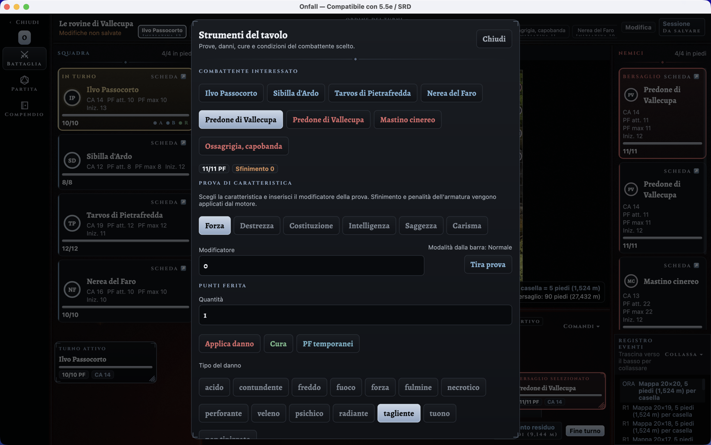<br/>
<sub>Table tools — ability checks, damage, healing, temporary HP and conditions by hand</sub>
</td>
</tr>
</table>

Named sessions are saved with the whole combat state, map and token placements, event log and dice
state, so a reopened session keeps rolling from where it stopped and its subsequent digital rolls
stay reproducible. They are autosaved after changes, and unsaved work is guarded on close.

## The Compendium

The Compendium is the archive everything else draws from: **character sheets**, **creature stat
blocks**, the shared **ability catalog**, and the local libraries of portraits and map backgrounds.

A character sheet can be filled in by hand or driven by the **guided SRD creation**, which proposes
class, background feat, skill proficiencies, starting weapons, cantrips, prepared spells and class
resources in exactly the quantities the SRD prescribes, and validates each choice as it is made.
Existing manual sheets are left untouched until the guided mode is activated on them. From there a
character advances from level 1 to 20 at the official XP thresholds; class resources, proficiencies,
feats, cantrips, prepared spells, spellbooks, always-prepared spells and derived Extra Attacks stay
attached to the sheet and are available to the Compendium and the combat screens. Short and long
rests restore the resource pools from the sheet itself.

The armour class is not a single number typed in: the sheet chooses a **base method** — manual final
AC, unarmoured defence, a class feature such as Draconic Resilience, worn armour — and lists the
modifiers on top of it, so the total can be read back as the sum that produced it.

Creatures use the 2025 stat block model, wider than the projection the engine needs for combat, with
a live preview of the finished block at the top of the editor.

<table>
<tr>
<td align="center">
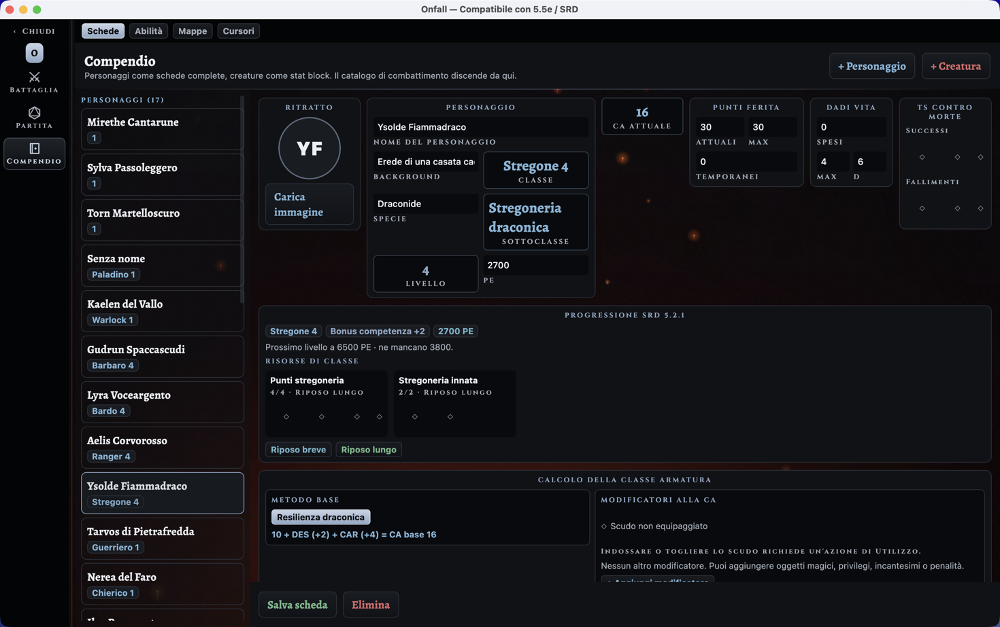<br/>
<sub>Character sheet — class, SRD progression, class resources, AC calculation</sub>
</td>
<td align="center">
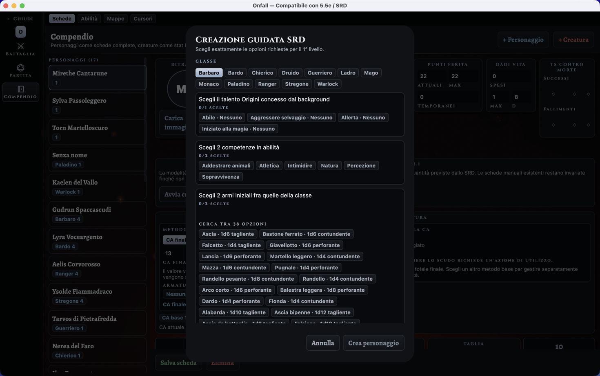<br/>
<sub>Guided SRD creation — class, background feat, skills and starting weapons</sub>
</td>
</tr>
<tr>
<td align="center" colspan="2">
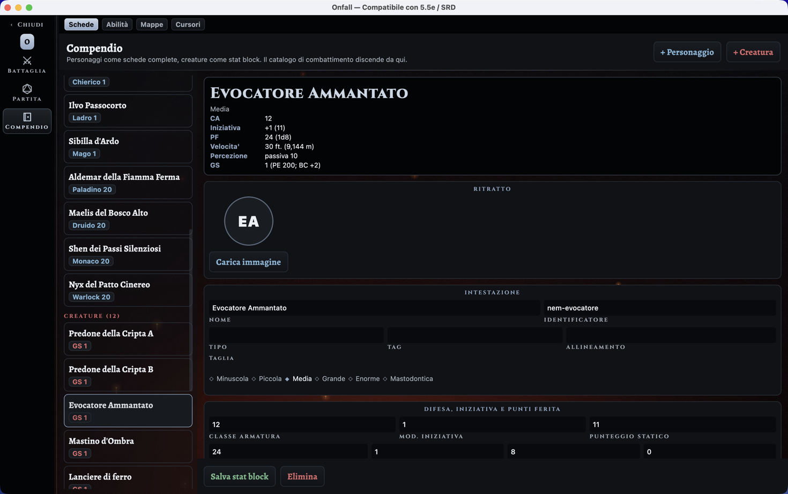<br/>
<sub>Compendium, creature — 2025 stat block with its live preview on top</sub>
</td>
</tr>
</table>

### Ability archive

Every rule the application can attach to a sheet lives in one archive, filtered by **category** —
common action, class feature, subclass feature, origin feat, general feat, fighting style, epic boon,
cantrip, spell, metamagic, eldritch invocation, class option, custom — and by **class**. Each entry
declares how it behaves at the table: cost, whether it is active or passive, and, for spells, level,
school, casting time, components, duration and concentration. When an ability is picked from a sheet
instead, the same catalog is searched by name, rule text or prerequisite.

Entries coming from the SRD pack are **read only** and marked as such; the table decides only whether
to play them as active or passive. Anything else can be written from scratch, or produced with
*duplicate as custom* from an SRD entry and edited freely from there.

<table>
<tr>
<td align="center">
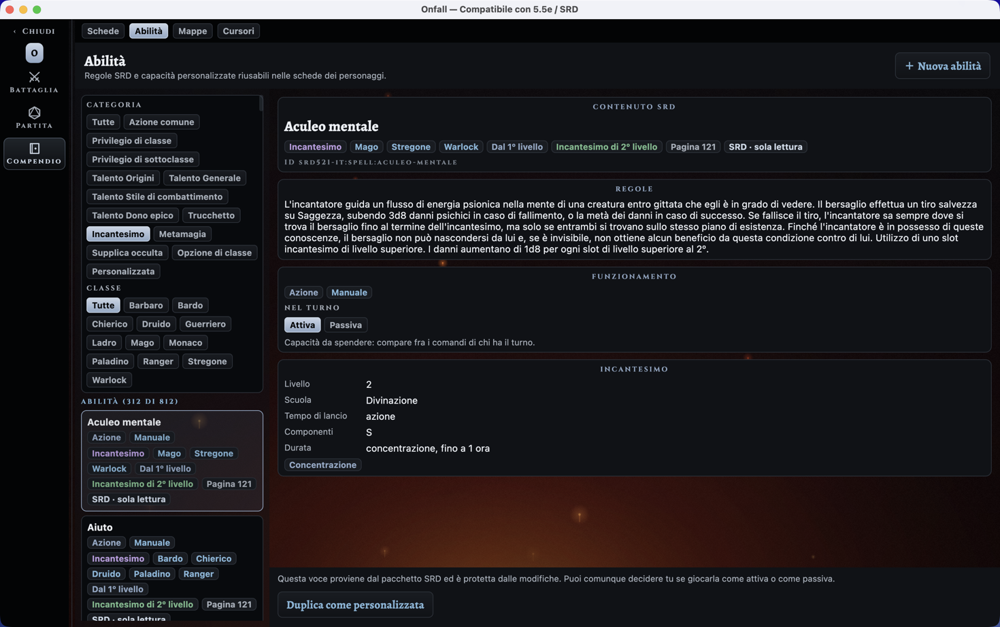<br/>
<sub>Ability archive — entries filtered by category and class, spell detail on the right</sub>
</td>
</tr>
</table>

### Local libraries

Portraits and map backgrounds are uploaded once and reused in every session. Every creature also has
an immediate **vector portrait drawn from code**, so the default visual set has no external
image-licensing dependency, and the local libraries only ever hold images the player chose.

On the desktop the pointer is part of the theme: five cursor pairs, each with a pointing pose and a
map-grabbing pose, in three sizes, applied to the window as soon as they are picked and remembered
across runs.

<table>
<tr>
<td align="center">
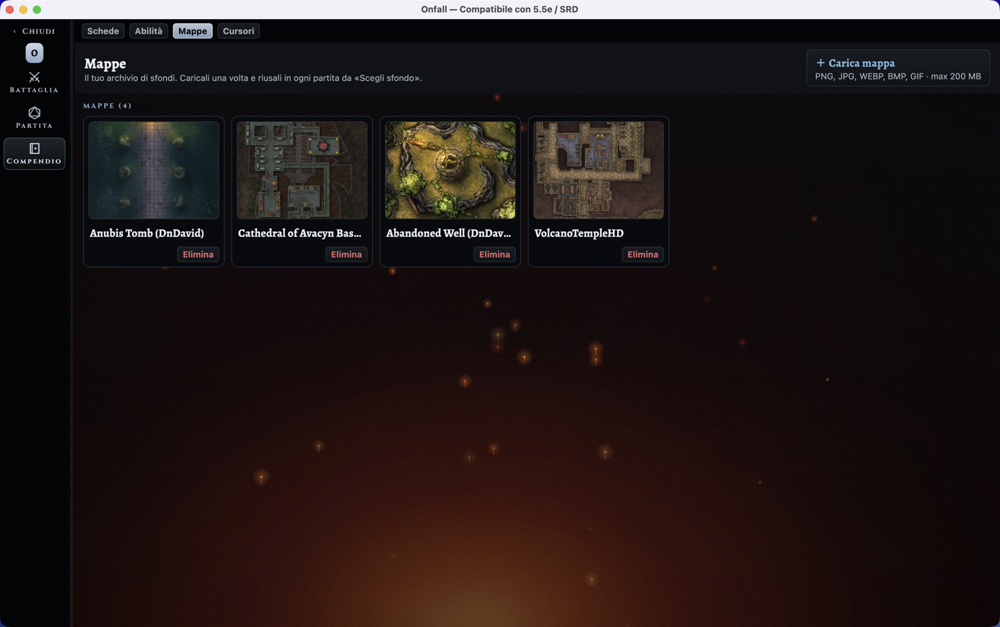<br/>
<sub>Map archive — backgrounds uploaded once and reused in every session</sub>
</td>
<td align="center">
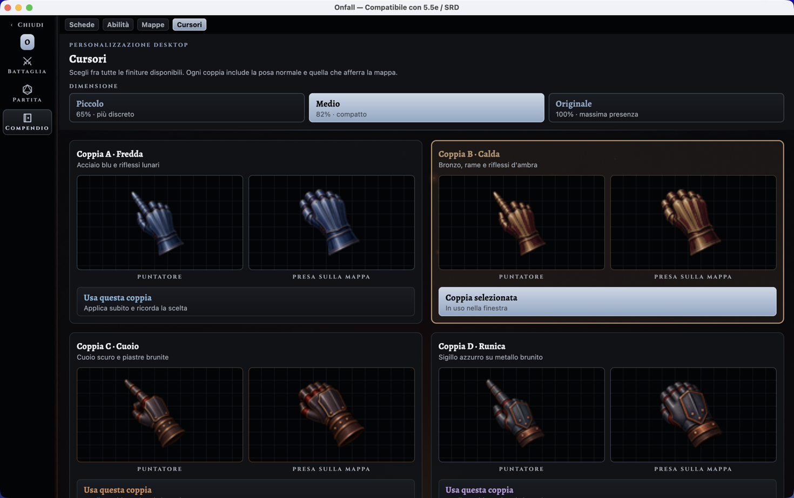<br/>
<sub>Desktop cursors — five pairs, each with a pointing and a map-grabbing pose</sub>
</td>
</tr>
</table>

## On the phone

The same screens run on Android from the same code. The battle becomes one surface at a time
(Stage, Party, Enemies, Log), with the controls always within thumb reach, and the desktop shell
falls back to the same compact layout when its window is narrowed below the width three panels
need.

## SRD content pack

The Italian SRD 5.2.1 pack is a separate module, so the engine and the licensed content never mix.
It carries 12 classes with their SRD subclasses, 408 class and subclass feature records (including
10 metamagics and 28 eldritch invocations), 17 feats, 339 spells and the SRD weapon table. It is
distributed under CC BY 4.0; see [`NOTICE-SRD.md`](NOTICE-SRD.md).

## Architecture

| Module | Language | Role |
|---|---|---|
| `engine/domain-model` | Java 17 | actors, abilities, conditions, state, campaigns. Immutable, zero dependencies |
| `engine/core-engine` | Java 17 | seeded dice, state machine, append only audit, XP budget |
| `engine/persistence-json` | Java 17 | atomic saves, backups, import and export |
| `engine/character-rules` | Kotlin | versioned class choices, XP progression and class resources |
| `engine/sheet-model` | Kotlin | 2024 character sheet and 2025 monster stat block |
| `content/srd-5.2.1-it` | Kotlin/JSON | Italian SRD classes, feats, actions and spells (CC BY 4.0) |
| `shared-ui` | Kotlin + Compose MP | theme, components, screens, presentation state |
| `desktop-app` | Kotlin | JVM window, dense shell |
| `android-app` | Kotlin | Activity, touch shell |

The engine is Java and stays usable from both platforms because Android and desktop both run on JVM
bytecode. The shared UI lives in `jvmSharedMain` rather than `commonMain`, which lets it use the
engine's Java classes directly.

`core-engine` knows nothing about texts, classes, or monsters: the rules live in the engine, the
content in separate packages.

Every engine module, the content pack and the presentation state carry their own unit tests, under
`engine/*/src/test`, `content/srd-5.2.1-it/src/test` and `shared-ui/src/desktopTest`.

The local disk is the source of truth: sheets, ability catalog, sessions, images and preferences are
written under `~/.onfall`, atomically and with backups.

## Run

### Desktop

```bash
# standard run
./gradlew :desktop-app:run

# with Compose Hot Reload, useful during development
# (the main class must be passed explicitly from the command line)
./gradlew :desktop-app:hotRun --mainClass=app.d6d.desktop.MainKt

# with a custom data directory
./gradlew :desktop-app:run -Donfall.dataDir=/path/to/dir
```

On first run Gradle downloads the dependencies and compiles the engine and the
shared UI, so the window can take a minute or two to appear. The `run` task
stays attached to the running application: close the window (or press `Ctrl+C`)
to stop it.

### Android

With a device or emulator connected:

```bash
./gradlew :android-app:installDebug
```

Then launch Onfall from the device's or emulator's app launcher.

### Tests

```bash
# every suite, engine modules and shared UI together
./gradlew check

# engine and content pack only
./gradlew test
```

`shared-ui` is a Kotlin Multiplatform module, so its suite is `:shared-ui:desktopTest` and it is
reached by `check`, not by `test`.

## License

**All rights reserved.** The code may be consulted **only for analysis and technical evaluation**. It
may not be run for use, forked, redistributed, or reused in part, not even single fragments, in other
projects. The full terms are in [`LICENSE.md`](LICENSE.md).
