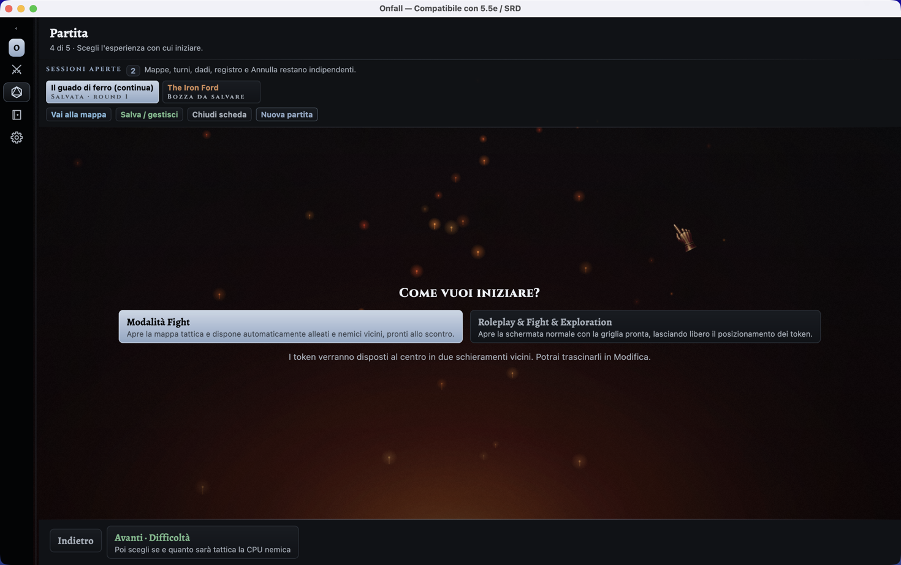
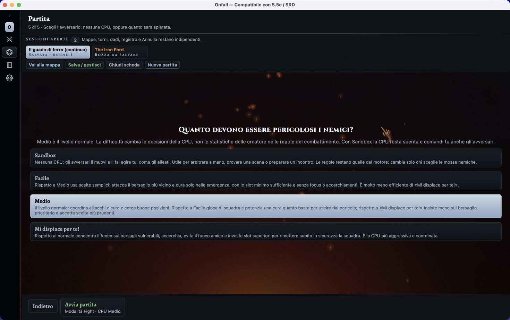
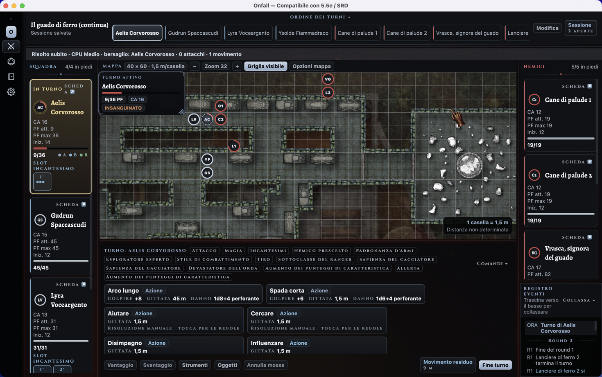
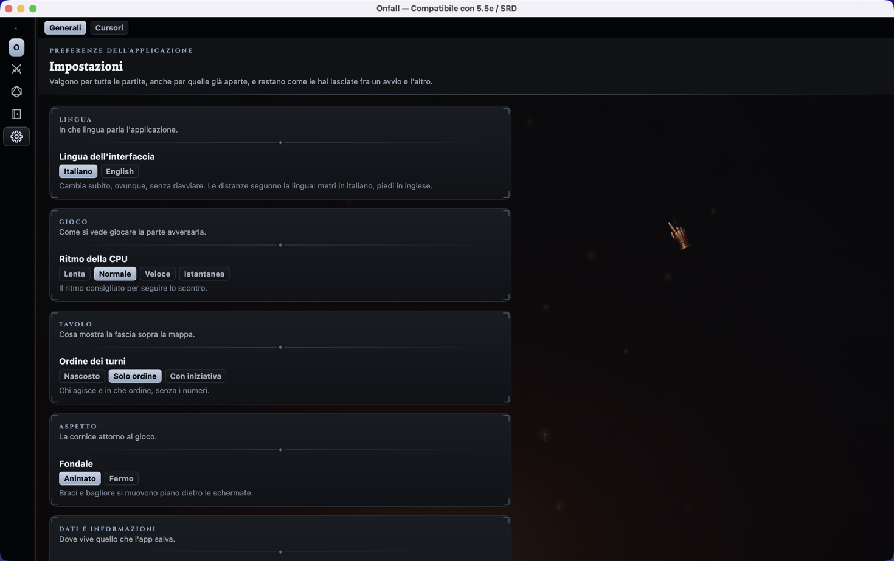

# Onfall

Onfall is an offline-first combat and encounter tracker compatible with 5e and 5.5e (D&D 2024).
Multiplayer support is planned for the future. The application includes a separate bilingual SRD
5.2.1 content pack (Italian and English) for guided character creation, class progression, feats,
actions and spells.
Its attribution and licence notice are in [`NOTICE-SRD.md`](NOTICE-SRD.md). The engine, user
interface and bundled encounter examples are original, and desktop and Android share the same
engine, data, and screens.

> **Source-available repository.** The application may be downloaded, compiled, installed, and used
> to play games for personal, non-commercial purposes. The source may also be reviewed for technical
> evaluation, but it may not be modified, forked, redistributed, or reused in other projects. See
> [`LICENSE.md`](LICENSE.md).

## What it is

Five parts living on the same engine:

1. the **Compendium**, an editable archive of characters, creatures, and reusable abilities;
2. an **encounter builder** that turns Compendium templates into an independent game session;
3. a **combat engine** that is independent from the interface, deterministic, audited, and undoable;
4. an **enemy CPU** that plays the opposing side when nobody at the table wants to, at three levels
   of ruthlessness or not at all;
5. a **game interface** that presents the fight as a turn based battle.

Four destinations hold them together, and the navigation rail on the left collapses to icons, or
disappears entirely, when the table needs the room. The screenshots below use the Italian labels
**Battaglia** (battle), **Partita** (session), **Compendio**
(Compendium) and **Impostazioni** (Settings). The language can be switched to English at runtime.

## Starting a session

A session begins from one of four places: a **bundled encounter**, the **templates** already in the
Compendium, **from scratch** — which opens the Compendium to write the cast first — or a **saved
session**. The three bundled encounters are written to be played as they are and to show the engine
at different points of a campaign: *Le rovine di Vallecupa* (level 1), *Il guado di ferro* (level 4),
*La corona spezzata* (level 20).

The builder then walks through five steps: where to start from, who takes part, the grid, how to
begin, and who commands the opposition. In the participants step each template gets a **faction**
and a **quantity**, so the same stat block can enter the fight four times without being duplicated
in the archive. The grid step sets columns, rows and the distance one square represents. Distances
follow the selected language: metres in Italian, using the rules conversion (5 feet = 1.5 m), and
feet in English. The mode step chooses between **Fight mode**, which lays allies and enemies out
facing each other and ready to roll, and **Roleplay & Fight & Exploration**, which opens the same
grid empty and leaves placement to the table. The last step picks the opposition: **Sandbox**, where
the table moves the enemies exactly as it moves the allies, or one of the three CPU levels described
below.

A combatant is **copied** into the session, so ordinary changes to HP, conditions, turns, and
position never alter its Compendium template. Explicit stat corrections and spent resources — Action
Surge, Wild Shape, spell and Pact slots, healing uses, and each of them under Undo too — are instead
synchronized with the authoritative sheet, and the log says so plainly when a write does not go
through. Several sessions stay open at once in independent tabs, each with its own map, turn order,
dice state, event log and undo history.

<table>
<tr>
<td align="center">
<br/>
<sub>Starting a session — bundled encounters, saved templates, from scratch, or a saved session</sub>
</td>
</tr>
<tr>
<td align="center">
<br/>
<sub>Encounter builder — grid size and the distance each square represents</sub>
</td>
</tr>
<tr>
<td align="center">
<br/>
<sub>How to begin — Fight mode, or the same grid left empty for roleplay and exploration</sub>
</td>
</tr>
</table>

## The battle

On the desktop the battle screen keeps three areas visible together: the **party** on the left, the
**battle scene** in the center, the **enemies** on the right. The turn order runs across the top —
bare, with each initiative roll beside it, or hidden altogether to give the map the room — and the
event log stays below the enemies. The side columns **resize by dragging their edge**, and when
they get narrow each combatant's information folds into a vertical list instead of being truncated.

The active combatant's abilities are listed under the map. Picking one puts the screen in aiming
mode; picking a target completes it. The engine covers attacks and area effects with digital d20
rolls, advantage and disadvantage, damage types, saving throws, conditions, concentration, death
saves, healing, temporary hit points and exhaustion, and it refuses what the rules refuse — an
out-of-range shot is reported as a warning, not silently resolved.

**Healing abilities are resolved by the app**, not called by hand: the engine checks the target is
on the healer's side, that a self-only or ally-only spell is used as written, and that a dead target
is not brought back by ordinary healing. **Spell slots and Pact slots** are carried into the fight
from the sheet, shown on the card of whoever holds them, and spent as part of the same undoable
command as the spell. The engine can also cast a healing spell from a higher slot and scale its dice
to the level chosen, up to ninth; today that is the enemy CPU's move, described below, while from
the table the spell is played at its own level.

Initiative ties can be played **together or separately**, and the choice is made before the fight
starts: with ties joined, everyone on the same initiative acts in one shared turn and the screen
lets you pick which of them is holding the ability bar. Once combat is active the setting is locked.

The tactical map is a grid. You **zoom with the mouse wheel**, drag the tokens to move them, and
change the scale and the size on screen. Map options set columns and rows, grid visibility and
opacity, the background image taken from the archive, and an automatic arrangement of every token.

**Table tools** cover the same state changes when they have to be entered by hand: an ability check
with its modifier, damage of a chosen type, healing, temporary hit points, conditions and
exhaustion, on any combatant and not only the one holding the turn.

With **Edit mode** on, the table composes the scene freely: it corrects name, AC, HP, and initiative
directly on the cards, reorders the turns and picks the current one, adds combatants to either side,
drags characters from the side bars onto the map, and moves tokens ignoring the movement limits.
Outside Edit mode those shortcuts disappear, so a session is not altered by mistake.

Every action lands in an **append-only event log**, and successful engine commands can be undone
without advancing the random number generator, so the rolls that follow an undo are the rolls that
would have followed anyway.

<table>
<tr>
<td align="center">
<br/>
<sub>Battle screen — party, tactical map, enemies, turn order, event log</sub>
</td>
</tr>
<tr>
<td align="center">
<br/>
<sub>Edit mode — name, AC, HP and initiative corrected on the cards, tokens moved freely</sub>
</td>
</tr>
<tr>
<td align="center">
<br/>
<sub>Table tools — ability checks, damage, healing, temporary HP and conditions by hand</sub>
</td>
</tr>
</table>

Named sessions are saved with the whole combat state, map and token placements, event log and dice
state, so a reopened session keeps rolling from where it stopped and its subsequent digital rolls
stay reproducible. They are autosaved after changes, and unsaved work is guarded on close. Beside
those chosen saves the application keeps an atomic **draft of the whole workspace**, deleted after a
clean exit: if the process is interrupted, the next run offers back every open tab, including the
sessions that never had a name.

## The enemy CPU

The opposing side can be left to the table or handed to a **deterministic CPU** that commands it and
nothing else: it never plans for a member of the party, and it never touches a turn that is not its
own. It reads the combat state to decide and then acts through the same public commands the table
uses, so its moves land in the same event log, cost the same turn budget, and can be undone from the
same history.

Difficulty changes only the **quality of the choices**. Rolls, armour class, hit points and the turn
budget are the engine's, identical at all three levels — nothing is inflated to make the CPU harder.

| Level | How it plays |
|---|---|
| **Sandbox** | No CPU at all. You move the opposition and make it act, exactly as you do the allies: useful for refereeing by hand, trying a scene out, or setting an encounter up. |
| **Easy** | Keeps it simple: the nearest target, the first useful ability, healing only in an emergency and with the smallest slot that will do. No focus fire, no flanking. |
| **Medium** | The normal level. It coordinates attacks and healing, looks for good positions, plays as a team, and upcasts a heal just enough to pull an ally out of danger. |
| **Sorry for you!** | Focuses fire on vulnerable targets, flanks, avoids friendly fire and spends higher slots to get its whole side safe at once. |

The turn is played back **one command at a time**, so the table sees each move and each attack
before the next, the selection following whichever enemy is acting; the pace is set in Settings,
from a long pause between commands down to *Instant*, which resolves it all at once. Each command
lands in the event log as it happens, and when the turn is over the strip above the map states the
outcome: the level played, the priority target the group had picked, and how many attacks, heals and
moves it took.

The whole CPU turn can be **undone as one batch**, after which automation stays paused until *Resume
CPU* is pressed, so the table can take the enemy side back at any point. If the state changes
between one command and the next — someone edits a card, applies damage by hand, resolves something
at the table — the CPU stops rather than acting on a board it did not plan for, and says so. A
safety limit of sixteen decisions per combatant guarantees it always hands the turn back.

<table>
<tr>
<td align="center">
<br/>
<sub>Choosing the opposition — Sandbox, or three levels that change the choices and never the rules</sub>
</td>
</tr>
<tr>
<td align="center">
<br/>
<sub>After a CPU turn — the enemies closed in and focused one target down to bloodied, with the
summary above the map and every command in the log</sub>
</td>
</tr>
</table>

## The Compendium

The Compendium is the archive everything else draws from: **character sheets**, **creature stat
blocks**, the shared **ability catalog**, and the local libraries of portraits and map backgrounds.

A character sheet can be filled in by hand or driven by the **guided SRD creation**, which proposes
class, complete background, ability increases, skill and tool proficiencies, starting-equipment
package, cantrips, prepared spells, Wild Shape forms and class resources in exactly the quantities
the SRD prescribes, and validates each choice as it is made.
Existing manual sheets are left untouched until the guided mode is activated on them. From there a
character advances from level 1 to 20 at the official XP thresholds; class resources, proficiencies,
feats, cantrips, prepared spells, spellbooks, always-prepared spells and derived Extra Attacks stay
attached to the sheet and are available to the Compendium and the combat screens. **Spell slots** —
and the Warlock's Pact slots, counted apart — are derived per level and tracked on the sheet, so the
fight starts from the pool the character actually has left. Short and long rests restore the
resource pools from the sheet itself, and a long rest is also where a Druid swaps one known Wild
Shape form for another.

The armour class is not a single number typed in: the sheet chooses a **base method** — manual final
AC, unarmoured defence, a class feature such as Draconic Resilience, worn armour — and lists the
modifiers on top of it, so the total can be read back as the sum that produced it.

Creatures use the 2025 stat block model, wider than the projection the engine needs for combat, with
a live preview of the finished block at the top of the editor.

<table>
<tr>
<td align="center">
<br/>
<sub>Character sheet — class, SRD progression, class resources, AC calculation</sub>
</td>
</tr>
<tr>
<td align="center">
<br/>
<sub>Guided SRD creation — class, background, skills and starting equipment</sub>
</td>
</tr>
<tr>
<td align="center">
<br/>
<sub>Compendium, creature — 2025 stat block with its live preview on top</sub>
</td>
</tr>
</table>

### Ability archive

Every rule the application can attach to a sheet lives in one archive, filtered by **category** —
common action, class feature, subclass feature, origin feat, general feat, fighting style, epic boon,
cantrip, spell, metamagic, eldritch invocation, class option, custom — and by **class**. Each entry
declares how it behaves at the table: cost, whether it is active or passive, and, for spells, level,
school, casting time, components, duration and concentration. An entry that **restores hit points**
declares the amount and who may receive it — self only, ally only, or either — and how many dice it
gains per slot level above its own; healing is always active and automated, because the app resolves
it, so it cannot be marked passive. When an ability is picked from a sheet instead, the same catalog
is searched by name, rule text or prerequisite.

Entries coming from the SRD pack are **read only** and marked as such; the table decides only whether
to play them as active or passive. Anything else can be written from scratch, or produced with
*duplicate as custom* from an SRD entry and edited freely from there.

<table>
<tr>
<td align="center">
<br/>
<sub>Ability archive — entries filtered by category and class, spell detail on the right</sub>
</td>
</tr>
</table>

### Local libraries

Portraits and map backgrounds are uploaded once and reused in every session. Every creature also has
an immediate **vector portrait drawn from code**, so the creature set itself carries no external
image-licensing dependency.

The map archive is the one exception: it ships with four battle maps, installed on first run so the
table is usable straight away. They are third-party artwork and their redistribution licence is
**not yet cleared** — see [NOTICE-MAPS.md](NOTICE-MAPS.md) before publishing a build. Everything
else in the local libraries is only ever what the player chose. Maps also have a folder of their
own, shown in the archive, so an existing collection can be dropped in instead of uploaded one by
one.

On the desktop the pointer is part of the theme: five cursor pairs, each with a pointing pose and a
map-grabbing pose, in three sizes, chosen in Settings, applied to the window as soon as they are
picked and remembered across runs.

<table>
<tr>
<td align="center">
<br/>
<sub>Map archive — backgrounds uploaded once and reused in every session</sub>
</td>
</tr>
<tr>
<td align="center">
<br/>
<sub>Desktop cursors — five pairs, each with a pointing and a map-grabbing pose</sub>
</td>
</tr>
</table>

## Settings

The fourth destination holds the preferences that outlive a single fight. They apply to every game,
including the ones already open, and they are written to disk as soon as they change.

**Language** switches the whole interface between Italian and English at once, with no restart, and
carries the units with it: metres in Italian, feet in English. Game terms follow the System
Reference Document in the language being read. The choice is only recorded once it is actually made
— until then the application follows the system, so carrying your data to a machine configured in
another language gives you that machine's language, not the previous one's.

**CPU pace** sets how the enemy turn is played back: *Slow*, *Normal*, *Fast*, or *Instant*, which
drops the pauses entirely and resolves the whole enemy turn in one go.

**Turn order** decides what the strip above the map shows: hidden, so the map gains the room; the
order alone, without the numbers; or the order with each combatant's initiative roll beside it.

**Backdrop** is a trade between looks and frames: embers and glow drifting slowly behind the
screens, or bare still stone, which is a few frames less to draw.

The last group is about data. **Panel layout** — widths, collapsed panels, map zoom, plate positions
— can be reset in one move, and the **data folder** the application writes to is shown so it can be
found, backed up, or copied to another machine. On the desktop a second section holds the cursors;
on Android, where the pointer is not the application's to set, that section is simply not there.

<table>
<tr>
<td align="center">
<br/>
<sub>Settings — language, CPU pace, what the turn-order strip shows, and the backdrop</sub>
</td>
</tr>
</table>

## On the phone

The same screens run on Android from the same code. The battle becomes one surface at a time
(Stage, Party, Enemies, Log), with the controls always within thumb reach, and the desktop shell
falls back to the same compact layout when its window is narrowed below the width three panels
need.

## SRD content pack

The Italian and English SRD 5.2.1 pack is a separate module, so the engine and the licensed content
never mix. It carries 12 classes with their SRD subclasses, 408 class and subclass feature records
(including 10 metamagics and 28 eldritch invocations), 4 complete backgrounds, 33
starting-equipment packages, 17 feats, 339 spells, 38 weapons and 64 complete Beast stat blocks
eligible for Wild Shape. It is distributed under CC BY 4.0; see [`NOTICE-SRD.md`](NOTICE-SRD.md).

The two editions are two sets of texts over **one set of identifiers**: the English pack adopts the
Italian ids rather than minting its own, and a generated crosswalk maps the names between them.
Those ids are what a saved sheet stores, so switching language renames what a character shows
without orphaning a single feature, spell or feat it had already chosen.

## Architecture

| Module | Language | Role |
|---|---|---|
| `engine/domain-model` | Java 17 | actors, abilities, conditions, state, campaigns. Immutable, zero dependencies |
| `engine/core-engine` | Java 17 | seeded dice, state machine, append only audit, XP budget, enemy CPU |
| `engine/persistence-json` | Java 17 | atomic saves, backups, import and export |
| `engine/character-rules` | Kotlin | versioned class choices, XP progression and class resources |
| `engine/sheet-model` | Kotlin | 2024 character sheet and 2025 monster stat block |
| `content/srd-5.2.1-it` | Kotlin/JSON | Italian and English SRD classes, backgrounds, equipment, beasts, feats, actions and spells (CC BY 4.0) |
| `shared-ui` | Kotlin + Compose MP | theme, components, screens, presentation state |
| `desktop-app` | Kotlin | JVM window, dense shell |
| `android-app` | Kotlin | Activity, touch shell |

The engine is Java and stays usable from both platforms because Android and desktop both run on JVM
bytecode. The shared UI lives in `jvmSharedMain` rather than `commonMain`, which lets it use the
engine's Java classes directly.

`core-engine` knows nothing about texts, classes, or monsters: the rules live in the engine, the
content in separate packages.

Every engine module, the content pack and the presentation state carry their own unit tests, under
`engine/*/src/test`, `content/srd-5.2.1-it/src/test` and `shared-ui/src/desktopTest`.

The local disk is the source of truth: sheets, ability catalog, sessions, images and preferences are
written under `~/.onfall`, atomically and with backups.

## Run

### Desktop

```bash
# standard run
./gradlew :desktop-app:run

# with Compose Hot Reload, useful during development
# (the main class must be passed explicitly from the command line)
./gradlew :desktop-app:hotRun --mainClass=app.d6d.desktop.MainKt

# with a custom data directory
./gradlew :desktop-app:run -Donfall.dataDir=/path/to/dir
```

On first run Gradle downloads the dependencies and compiles the engine and the
shared UI, so the window can take a minute or two to appear. The `run` task
stays attached to the running application: close the window (or press `Ctrl+C`)
to stop it.

### Android

With a device or emulator connected:

```bash
./gradlew :android-app:installDebug
```

Then launch Onfall from the device's or emulator's app launcher.

### Tests

```bash
# every suite, engine modules and shared UI together
./gradlew check

# engine and content pack only
./gradlew test
```

`shared-ui` is a Kotlin Multiplatform module, so its suite is `:shared-ui:desktopTest` and it is
reached by `check`, not by `test`.

## License

**All rights reserved.** The application may be downloaded, compiled, installed, and used to play
games for personal, non-commercial purposes. Modification, redistribution, forks, and reuse in other
projects are not permitted. The Italian and English SRD content pack remains separately available under CC BY
4.0. The full terms are in [`LICENSE.md`](LICENSE.md).
